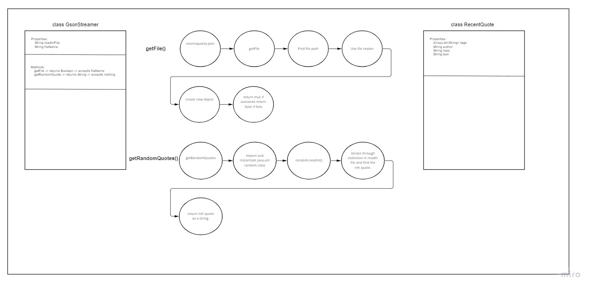
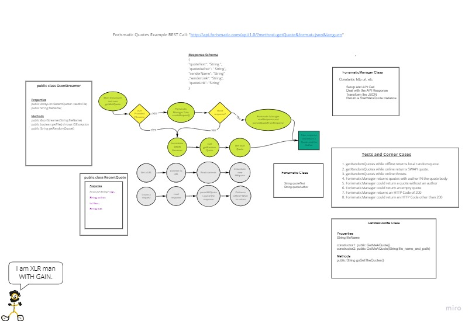

# Quotes

***Description:***  
- This application will read in a .json file that contains book quotes.
- After reading the .json file, it will return a random quote from the book.
-- -

***How to run App***  

`./gradlew run`
-- -

***Project Team:***  
- Jason Wilson (Gson) 
- [Jon Rumsey](https://github.com/nojronatron)
- [Abdulahi Mohamud](https://github.com/AbdulahiMohamud)
- [Chuck Altopiedi](https://github.com/ChuckAlto)

***Assisted by:***
- [Roger Reyes](https://github.com/RogerMReyes)
- [Raul Zarate](https://github.com/zaratr)
- Alex White 

# Quotes from an API

***Description***
-This Application will make an API call to a random quote API.
-after making an API request it will return a random quote.
-- -

***How to run App***

`./gradlew run`
-- -

***Project Team:***
- Jason Wilson (Gson)
- [Jon Rumsey](https://github.com/nojronatron)
- [Abdulahi Mohamud](https://github.com/AbdulahiMohamud)
- [Chuck Altopiedi](https://github.com/ChuckAlto)

***Assisted by:***
- [Raul Zarate](https://github.com/zaratr)
- Ben Mills, Java TA

